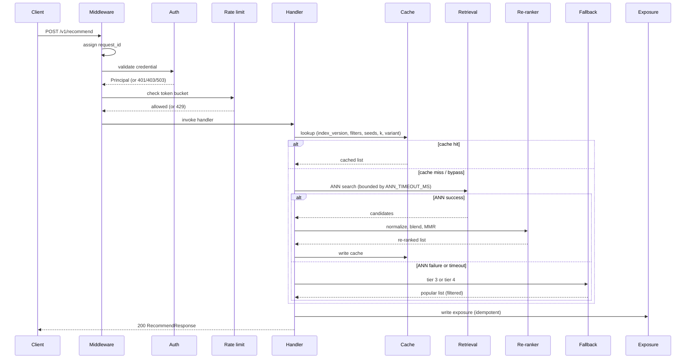

# Production API

Design doc for M3. Twelve ADRs (0013–0024) record the decisions; this
document is the consolidated view — what is being built, how the pieces
fit, and where the boundaries are. When this document and an ADR
disagree, the ADR wins, and the disagreement is a bug to be fixed in the
same change.

> **Status:** locked for M3. Changes to the request path, the response
> schema, or the auth/rate-limit contracts require a new ADR.

---

## 1. Scope

**In scope for M3**

- Authentication (API key + JWT), authorization (scopes), and the
  failure responses (`401`/`403`) with a fail-closed policy.
- Per-credential rate limiting with a Redis token bucket and a
  per-instance fallback.
- A response cache with a BLAKE2b-128 key, jittered TTLs, negative
  caching, and a shared per-dependency circuit breaker for Redis.
- Re-ranker implementations (popularity, recency, MMR) filling the
  protocol stub from ADR-0005.
- Experiment assignment and exposure logging, backed by a committed
  `experiments.yaml`.
- Event ingestion (`POST /v1/events`) with a 1..100 batch, HMAC-hashed
  user ids, and a skew window.
- Real handlers for `POST /v1/recommend` and
  `GET /v1/items/{item_id}/similar`, composing retrieval, re-ranking,
  fallback, and cache.
- A four-tier fallback chain that serves a response when the database or
  the index is unavailable.
- Readiness with three states, and the observability contract
  (correlation id, bounded metric labels, forbidden log fields).
- Integration tests covering the failure paths and the composition.

**Out of scope for M3**

- Statistical analysis of experiments (SRM, significance, guardrails).
  Ships in M5; M3 only assigns and logs.
- The churn endpoint. Ships in M7.
- Load testing and the served-path performance numbers. Ships in M4.
- Deployment automation (CD, staging, rollback). Ships in M6.
- Service discovery and a canary with traffic shaping. Ships when the
  project has the infrastructure for it (ADR-0023).

---

## 2. Module layout

```
src/recsys/
├── api/
│   ├── app.py                     # factory, middleware wiring
│   ├── deps.py                    # dependency providers (Principal, settings)
│   ├── errors.py                  # exception handlers, error envelope
│   ├── readiness.py               # /readyz check runner + cache
│   ├── routers/
│   │   ├── health.py              # /livez, /healthz, /readyz
│   │   ├── metrics.py             # /metrics
│   │   ├── recommend.py           # POST /v1/recommend, GET /v1/items/{id}/similar
│   │   └── events.py              # POST /v1/events
│   ├── middleware/
│   │   ├── request_context.py     # correlation id (M0)
│   │   ├── access_log.py          # one structured line per request (M0)
│   │   ├── rate_limit.py          # token bucket, fallback
│   │   └── cache.py               # cache-aside, breaker consult
│   ├── schemas/                   # Pydantic models (contracts.md § 1, § 2)
│   │   ├── common.py              # ErrorEnvelope (M0)
│   │   ├── recommend.py           # RecommendRequest, RecommendResponse (M0)
│   │   ├── events.py              # EventBatch (new), EventAck (M0)
│   │   └── churn.py               # (M7)
│   └── auth/
│       ├── principal.py           # Principal dataclass
│       ├── api_key.py             # hash comparison
│       └── jwt.py                 # HS256 validation, claim checks
├── retrieval/
│   ├── base.py                    # IndexBackend protocol (M2)
│   ├── registry.py                # class registry (M2)
│   ├── filters.py                 # FILTER_FIELDS (M2)
│   ├── identity.py                # index_version hash (M2)
│   ├── pgvector.py                # PgvectorBackend (M2)
│   ├── numpy_backend.py           # NumpyBackend (M2)
│   ├── rerank.py                  # Reranker protocol + implementations (M3)
│   ├── build.py                   # index build (M2)
│   └── promote.py                 # promote / rollback (M2)
├── fallback/
│   ├── popularity.py              # PopularityProvider + synthetic (M3)
│   ├── snapshot.py                # popularity_snapshot refresh + read
│   └── memory.py                  # in-memory list for tier 4
├── experiments/
│   ├── assignment.py              # deterministic hash (M3)
│   ├── config.py                  # experiments.yaml loader + validation (M3)
│   └── exposure.py                # exposure writer (M3)
├── events/
│   └── hashing.py                 # HMAC-SHA256 user_id hasher (M3)
├── monitoring/
│   ├── logging.py                 # structlog (M0, extended M3)
│   ├── metrics.py                 # Prometheus registry (M0, extended M3)
│   ├── tracing.py                 # two-mode tracer (M3)
│   └── breaker.py                 # circuit breaker (M3)
├── config/
│   ├── settings.py                # Pydantic Settings (M0, extended M3)
│   └── hot.py                     # hot config loader + poller (M3)
└── embeddings/
    ├── preprocess.py              # (M1)
    ├── encoder.py                 # (M1)
    ├── onnx_export.py             # (M1)
    ├── artifacts.py               # (M1)
    └── pipeline.py                # (M1)

config/hot.yaml                    # rate limits, re-ranker weights, TTLs
experiments.yaml                   # committed experiment declarations
```

Each module has one responsibility. `rerank.py` holds the re-ranker
protocol and its implementations; `fallback/` holds the two fallback
tiers' data sources; `experiments/` holds assignment and logging, not
analysis (that is M5's `evaluation/`-adjacent work).

---

## 3. Request lifecycle

A `POST /v1/recommend` request passes through the following stages. The
order is fixed; each stage's failure behavior is stated.



### Stage 1 — request context

`RequestContextMiddleware` (M0) assigns or accepts a request id, binds
it to structlog's contextvars, and attaches it to the response's
`X-Request-ID` header. The request id appears in every log line, every
span, and the response header (ADR-0021).

### Stage 2 — authentication

`Principal` is produced by a FastAPI dependency that reads the
credential from `X-API-Key` or `Authorization`, validates it, and
returns a `Principal(subject, scopes, credential_hash)`. The raw
credential is not retained after validation (ADR-0013).

| Outcome | Response |
|---|---|
| Both credentials presented | `400 bad_request` |
| No credential | `401 unauthenticated` |
| Invalid / expired / `iat` too old / unknown `kid` | `401 unauthenticated` |
| Valid credential, insufficient scope | `403 forbidden` |
| Validator unavailable (fail-closed) | `503 unavailable` |

### Stage 3 — rate limiting

`RateLimitMiddleware` computes the credential hash, looks up the
endpoint class from the route template, and executes the Lua token
bucket script (ADR-0014). A refused request receives `429` with a
`Retry-After` header whose value is derived from the token deficit.

If Redis is unreachable, the middleware falls back to a per-instance
token bucket whose limit is the configured limit divided by
`INSTANCE_COUNT`. The fallback is logged once and the
`recsys_rate_limit_degraded` gauge is set to 1.

Health endpoints (`/livez`, `/healthz`, `/readyz`) and `/metrics` bypass
the limiter (ADR-0014 § What is not rate limited).

### Stage 4 — handler entry

The handler resolves the active index (ADR-0022: a 10-second per-process
cache over `index_registry`), computes the cache key, and consults the
cache. An open Redis breaker makes the lookup an immediate miss without
a round trip (ADR-0015).

### Stage 5 — retrieval

On a cache miss, the handler calls the active `IndexBackend` with
`candidate_k = RERANK_CANDIDATE_MULTIPLIER × k` (ADR-0016). The call is
bounded by `ANN_TIMEOUT_MS`; a timeout or a raise moves the chain to the
fallback tiers (ADR-0020).

### Stage 6 — re-ranking

On a successful retrieval, the handler invokes the re-ranker
(ADR-0016): normalize each signal within the candidate window, blend
with the configured weights, then apply MMR to the top
`RERANK_MMR_WINDOW`. Seeds are excluded before metrics are computed
(ADR-0009 § 4, extended in M2 to the runner).

A re-ranker that raises returns the retrieval list; the response's
`meta.source` remains `ann` and `meta.rerank` names the failing step.

### Stage 7 — cache write

The re-ranked list is written to Redis with the key that includes
`index_version`, the variant, and the request's normalized content
(ADR-0015). The write is best-effort; a write failure is logged and
counted but the response is returned.

### Stage 8 — experiment exposure

If the request is part of an experiment (the assignment ran before
retrieval), the exposure is written. The write is idempotent by a
`request_id`-derived `event_id` (ADR-0017). A write failure is logged
and counted; the response is still returned.

### Stage 9 — response

The response is a `RecommendResponse` whose `meta.source` names the tier
that produced the list (`cache`, `ann`, `fallback_ann`, or
`fallback_cached`) and whose `meta.experiment` echoes the assignment
(may be null). A request whose entire chain failed returns `503` with
`meta.source = "none"`.

---

## 4. Authentication and authorization

The full decision is ADR-0013. Summary:

- **Two credential models:** API key (server-to-server) and JWT
  (user-facing). Presenting both is an error.
- **API keys are stored as Argon2id hashes.** The configured list
  (`API_KEYS`) is a set of hashes; validation is a hash comparison.
- **JWT is HS256 by default.** Required claims: `sub`, `exp`, `iat`,
  `scope`. A token without `iat` is rejected.
- **Two key lists:** `API_KEYS` (read) and `API_KEYS_ADMIN` (read +
  admin). A read key cannot promote an index.
- **Fail-closed.** A validator that cannot run returns `503`; the
  request is not authenticated by default.
- **No revocation in M3.** Rotation is a two-step procedure; short
  `exp` and a secret rotation are the revocation mechanisms.

---

## 5. Rate limiting

The full decision is ADR-0014. Summary:

- **Token bucket in Redis via a Lua script.** O(1) memory per key, one
  round trip, atomic read-modify-write.
- **Key:** `rate_limit:{blake2b-16(credential)}:{class}`. Never the raw
  credential.
- **Classes:** `recommend`, `events`, `admin`, `unlimited` (health,
  metrics). The limits are in `config/hot.yaml` (ADR-0022).
- **Failure mode:** per-instance token bucket whose limit is the
  configured limit divided by `INSTANCE_COUNT`. The degradation is
  logged once and metered.
- **Response:** `429` with `Retry-After` computed from the token
  deficit.

---

## 6. Cache and circuit breaker

The full decisions are ADR-0015 (Redis behavior) and ADR-0022 (the
active-index poll). Summary:

- **Cache-aside.** The request path looks up, on a miss runs retrieval,
  and writes the result. No write-through, no invalidation messages.
- **Key:** `cache:v1:{class}:{blake2b-16(request)}[:{variant}]`.
  `index_version` is part of the hashed request, so an index swap
  produces a new key space.
- **TTL:** per class (`recommend` 300 s, `similar` 600 s, negative
  30 s), jittered by ±10%.
- **Negative caching.** A "no such item" miss is stored as a sentinel
  for the negative TTL.
- **Re-ranked result is not cached.** The recency term is a function of
  wall-clock time.
- **Breaker:** one per external dependency, consecutive failures, a
  single HALF_OPEN probe, exponential backoff on the OPEN duration.

---

## 7. Re-ranker

The full decision is ADR-0016. Summary:

1. **Normalize.** `sim` min-max in the candidate window; `pop` via
   `log1p` then min-max; `rec` via an exponential decay with a
   configurable half-life. Degenerate `max == min` returns `0.5` for
   every candidate (neutral).
2. **Blend.** `w_sim * sim_norm + w_pop * pop_norm + w_rec * rec_norm`.
   Weights are in `config/hot.yaml` and are validated to lie in
   `[0, 1]`; the sum must be `> 0`, not `1`.
3. **MMR.** Applied to the top `RERANK_MMR_WINDOW` (default 50) when
   `k >= RERANK_MMR_MIN_K` (default 10) and the retrieval layer
   exposes the candidate vectors. `lambda` is config.

The re-ranker returns the same candidates it received (a reorder, not a
filter). Seeds are excluded before the metrics are computed; the
exclusion is the caller's responsibility (the runner and the handler
each over-fetch and filter).

---

## 8. Experiment assignment and exposure

The full decision is ADR-0017. Summary:

- **Declaration:** `experiments.yaml` at the repository root, read once
  at startup and validated. Unknown fields and invalid values abort
  startup.
- **Salt:** each experiment declares one; the assignment code prefixes
  the environment (`{APP_ENV}:{salt}`), so a dev assignment is
  independent of a prod one.
- **Assignment:**
  `bucket = sha256(f"{effective_salt}:{user_id}") % 10_000`, mapped to
  variants by the experiment's allocation.
- **Exposure:** written when the variant is served, after all
  middleware that can reject the request. Idempotent by
  `sha256(f"exposure:{experiment}:{request_id}")`.
- **Fallback variant:** `control`, with a `fallback_reason` in the
  exposure.
- **Kill switch:** `EXPERIMENT_DISABLED=1` treats every experiment as
  `stopped` for this process. Read at startup.

---

## 9. Event ingestion

The full decision is ADR-0018. Summary:

- **Batch of 1 to 100.** The request body is `{"events": [ ... ]}`.
  Response `202 {accepted, duplicates, rejected}`.
- **Idempotency:** client-supplied `event_id` with a unique constraint
  and `ON CONFLICT DO NOTHING`. A server-generated id is returned when
  the client omits one; it is `sha256(f"{request_id}:{index}")`.
- **PII hashing:** `user_id_hash = HMAC-SHA256(salt, user_id)`, with a
  versioned salt in `USER_ID_HASH_SALT_VERSION`. The raw id is never
  stored, logged, or traced.
- **Skew window:** `[now - 7d, now + 5m]`. Outside the window the event
  is rejected (`422`).
- **Synchronous write.** A single `executemany` in one transaction.
- **Retention:** 365 days (config), enforced by a job that lands in M6.

---

## 10. Fallback chain

The full decision is ADR-0020. Summary:

| Tier | `meta.source` | Source |
|---|---|---|
| 1 | `cache` | Redis cache (ADR-0015) |
| 2 | `ann` | ANN query + re-rank |
| 3 | `fallback_ann` | `popularity_snapshot` table |
| 4 | `fallback_cached` | In-memory popular list |
| 5 | `none` | `503` |

A tier produces a list, or the chain falls through. An empty list is
not an answer; a filtered fallback list that is empty falls through to
the next tier.

The fallback rate is a guardrail metric (ADR-0024 § Quality SLO). The
alert fires above 1% over a 5-minute window.

---

## 11. Readiness and observability

The full decisions are ADR-0019 (readiness) and ADR-0021
(observability). Summary:

- **`/livez`** answers "is the process alive" and touches nothing.
- **`/readyz`** answers "should this instance receive traffic" and
  returns three states: `ready`, `degraded`, `not_ready`. `db` and
  `index` are required; `redis` is optional. The check result is cached
  per process for 5 seconds; each check has its own timeout.
- **One correlation id** in the response header, the logs, and the
  spans. The id is not the trace id.
- **Metric labels are bounded.** A label whose values grow with traffic
  (a user id, a request id, an item id) is forbidden.
- **Log lines carry a `schema_version`** and use an `event` naming
  convention (`cache.hit`, `retrieval.fallback.ann`, ...).
- **Trace sampling:** 100% errors, 10% successes in prod. In-process
  ring buffer in dev; OTLP in prod.

---

## 12. Configuration

The full decision is ADR-0022. Summary:

| Category | Source | Examples |
|---|---|---|
| Boot | Environment via `Settings` | `DATABASE_URL`, `JWT_SECRET`, HNSW params |
| Hot | `config/hot.yaml`, polled | rate limits, re-ranker weights, cache TTLs |
| Static | `experiments.yaml` | experiment declarations |
| Runtime | `index_registry` row | the active `index_version` |
| Evaluation | `evaluation/thresholds.yaml` | the eval gate (not read by the API) |

A value belongs to one category. Secrets are environment-only. Hot
config is validated before a change takes effect; a malformed change is
logged and the previous value stays in effect.

---

## 13. What lands in M4

- Prometheus and Grafana wired end to end; the dashboards in
  `dashboards/`.
- Locust scenarios in `tests/load/`; the served-path p95 measured
  against the latency SLO (ADR-0024) at the target RPS.
- OpenTelemetry collector deployment (the OTLP mode of the tracer).
- The latency/recall tuning of `hnsw_ef_search` against the served
  path; the README's performance table filled with measured numbers.

None of these change the request path, the auth contract, or the
fallback chain. That stability is the point of writing this document
before M4 starts.

---

## 14. Phased delivery

The code lands in eight sub-milestones, each independently reviewable
and testable. The order is deliberate: each sub-milestone's code
depends only on the ones before it.

| Sub | Deliverable | Depends on |
|---|---|---|
| M3.1 | Auth: `Principal`, api_key + jwt validators, `deps.py`, error handlers | — |
| M3.2 | Rate limit: Lua script, middleware, fallback limiter | M3.1 (credential hash) |
| M3.3 | Cache + breaker: `breaker.py`, cache middleware, `hot.yaml` loader | M3.2 (shared Redis breaker) |
| M3.4 | Re-ranker: `rerank.py` implementations, config, unit tests | — |
| M3.5 | Experiments: `experiments.yaml`, loader, assignment, exposure writer | M3.1 (request id) |
| M3.6 | Handlers: `recommend`, `similar`, `events`; fallback chain | M3.2–M3.5 |
| M3.7 | Readiness, observability additions, runbook entries | M3.3, M3.6 |
| M3.8 | Integration tests, README, CHANGELOG, closure | all |

---

## 15. Summary of decisions

| Topic | Decision | ADR |
|---|---|---|
| Auth | API key + JWT, fail-closed, two key lists, 401 vs 403 | [0013](adr/0013-authentication-strategy.md) |
| Rate limit | Token bucket in Redis, per credential, per class, per-instance fallback | [0014](adr/0014-rate-limiting.md) |
| Cache + breaker | Cache-aside, BLAKE2b key, jitter, negative cache, one breaker per dependency | [0015](adr/0015-cache-and-circuit-breaker.md) |
| Re-ranker | Normalize, blend, MMR; failure returns retrieval | [0016](adr/0016-reranker-composition.md) |
| Experiments | Committed YAML, per-env salt, exposure on serve, kill switch | [0017](adr/0017-experiment-assignment.md) |
| Events | Batch 1..100, HMAC hashing, skew window, retention policy | [0018](adr/0018-event-ingestion.md) |
| Readiness | `/livez` + `/readyz`, three states, cached checks | [0019](adr/0019-readiness-contract.md) |
| Fallback | Four tiers, in-memory popular list, 503 only when all fail | [0020](adr/0020-fallback-chain.md) |
| Observability | Correlation id, bounded labels, versioned log schema | [0021](adr/0021-observability-contract.md) |
| Config | Five categories, hot file, secrets env-only | [0022](adr/0022-config-management.md) |
| Deployment | Three artifacts, rolling update, additive migrations | [0023](adr/0023-deployment-strategy.md) |
| SLO | No SLA, three SLOs, error budget policy | [0024](adr/0024-slo-and-error-budget.md) |

With this document merged, the M3 code may begin.
